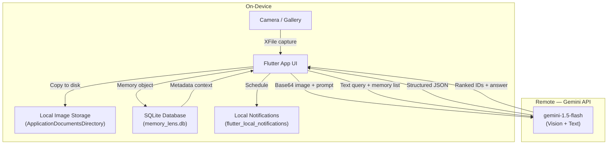
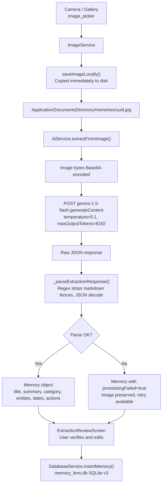
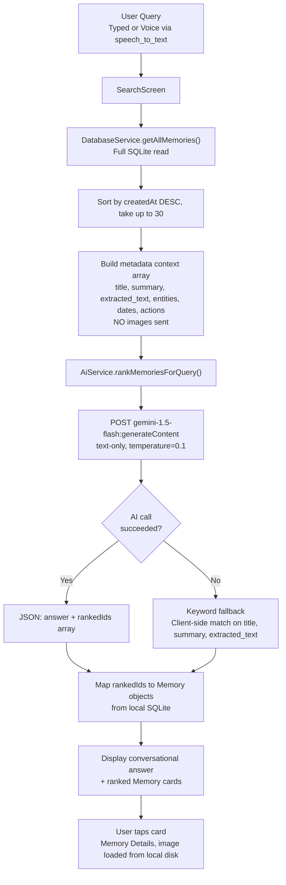

# 🧠 MemoryLens

### Your camera remembers what you don't.

> MemoryLens turns images of real-world information into structured, searchable personal memories. Capture a hackathon notice, a receipt, a whiteboard, or a visiting card — and ask about it later in plain language.


---

## Table of Contents

1. [What is MemoryLens?](#-what-is-memorylens)
2. [The Problem](#-the-problem)
3. [The Solution](#-the-solution)
4. [Demo](#-demo)
5. [Key Features](#-key-features)
6. [Real-World Use Cases](#-real-world-use-cases)
7. [Product Walkthrough](#-product-walkthrough--app-screens)
8. [How It Works](#-how-it-works)
9. [System Architecture](#-system-architecture)
10. [End-to-End Data Flow](#-end-to-end-data-flow)
11. [AI & Vision Architecture](#-ai--vision-architecture)
12. [Search & Retrieval Architecture](#-search--retrieval-architecture)
13. [AI Token Optimization](#-ai-token-optimization)
14. [Privacy & Security](#-privacy--security)
15. [Design System](#-design-system)
16. [Tech Stack](#-tech-stack)
17. [Project Structure](#-project-structure)
18. [Engineering Challenges](#-engineering-challenges--solutions)
19. [Technical Decisions](#-technical-decisions)
20. [Why MemoryLens?](#-why-memorylens)
21. [Testing](#-testing)
22. [Installation](#-installation)
23. [Configuration](#-configuration)
24. [Roadmap](#-roadmap)
25. [Future Vision](#-future-vision)
26. [Hackathon](#-hackathon)
27. [Team](#-team)
28. [Contributing](#-contributing)
29. [License](#-license)
30. [Acknowledgements](#-acknowledgements)
31. [References](#-references)
32. [Contact](#-contact)

---

## 🧠 What is MemoryLens?

MemoryLens is a mobile-first application that converts captured images into structured, queryable memories.

Most photo apps answer: *"Where are my photos?"*
MemoryLens answers: *"What was that thing I saw?"*

A student photographs a hackathon notice. MemoryLens reads it, extracts the title, deadline, and location, and stores it as a structured memory. Three days later, the student asks *"What was that hackathon?"* — and gets a direct, conversational answer pointing back to the original image.

The pipeline:

```
Capture → Understand → Structure → Store → Search → Act
```

MemoryLens is not a gallery replacement. It is a purpose-built tool for the specific workflow of:

> *"I photographed this because it mattered. Help me remember why."*

---

## ❗ The Problem

People encounter information worth remembering constantly:

- College notices pinned to bulletin boards
- Hackathon and event posters
- Electricity bills and receipts
- Visiting cards from professionals
- Deadlines on whiteboards
- Internship and workshop announcements
- Medicine labels and product information

The standard response: take a photo.

The outcome: that photo joins thousands of others. Six days later:

> *"I photographed that notice."* — Which one?
> *"Which screenshot had the internship deadline?"* — Scroll through 500 screenshots.
> *"What was written on that whiteboard?"* — Check 30 similar photos.
> *"Where was that event near the library?"* — Unknown.

**The information is not missing. Retrieval is the problem.**

Photo apps organize by date, location, or album. None of them understand *why* you took the photo. None of them know that a particular image contains a deadline for September 5th.

---

## 💡 The Solution

MemoryLens reframes image capture as a memory creation event.

```
RAW IMAGE
    ↓
VISUAL UNDERSTANDING (Gemini Vision)
    ↓
TEXT EXTRACTION + STRUCTURE
    ↓
title · summary · category · entities · dates · actions
    ↓
LOCAL SQLite STORAGE
    ↓
NATURAL-LANGUAGE RETRIEVAL
    ↓
ACT — set reminders, review originals, share details
```

The key distinction: **AI runs once at capture time**, not repeatedly during search. What gets stored is not just an image — it's meaning.

---

## 🎥 Demo

> 📌 **Demo video and screenshots coming soon.** Seed images used during development are in `assets/images/seed/`.

Sample seed data categories:
- `hackathon_notice.jpg` — Event with deadline
- `electric_bill.jpg` — Receipt with amount
- `business_card.jpg` — Contact information
- `zomato_internship.jpg` — Opportunity with deadline
- `gsoc_poster.jpg` — Event announcement
- `coffee_receipt.jpg` — Daily receipt
- `library_notice.jpg` — Notice with dates

---

## ✨ Key Features

### 📷 Smart Capture
Capture using the device camera or import from the gallery. Images are saved immediately at up to 1920px width with 85% quality compression before AI processing begins.

### 👁️ Vision Understanding
Google Gemini (`gemini-1.5-flash`) analyzes the full image — reading printed text, handwriting, and visual layout to understand context that pure OCR misses.

### 📝 Structured Memory
Every captured image produces a structured record containing:
- **Title** — 3–7 word human-readable label
- **Summary** — One-sentence description
- **Category** — `event`, `receipt`, `contact`, `document`, `notice`, or `other`
- **Extracted Text** — All visible text, verbatim
- **Entities** — Key-value pairs (merchant, amount, event name, location, organizer, etc.)
- **Dates** — ISO 8601 timestamps typed as `deadline`, `event_date`, `issue_date`
- **Actions** — Actionable tasks extracted (register, pay, attend) with due dates

### 🔎 Natural-Language Search
Ask questions in plain English, Hinglish, or Marathi:
- *"What was that hackathon notice?"*
- *"What deadlines are coming up?"*
- *"Which receipt had the electricity bill?"*
- *"Find something about an internship deadline."*

### 🎙️ Voice Search
Tap the microphone on the Search screen and speak your query. Uses the device's native speech recognition (`speech_to_text`) — no additional API call required.

### 🔔 Smart Reminders
- Deadlines detected during extraction can be converted into scheduled device notifications.
- Manual reminders (text-only, with optional photo attachment) can be created independently.
- Advance notification fires one day before a deadline automatically.

### 🧠 Remember Screen
A proactive tab that surfaces upcoming deadlines, recently added memories, and suggested actions — without requiring the user to search.

### 📚 Memory Browser
Browse all memories filtered by category (Event, Receipt, Notice, etc.) with a scrollable card layout.

### 🌓 Light & Dark Themes
Full warm Peach/Terracotta light theme and a deep warm Brown/Terracotta dark theme — both with independent semantic color systems.

### 🔒 Local-First Storage
All images and structured memory data live on-device in `ApplicationDocumentsDirectory` and a local SQLite database. No application backend, no cloud storage.

> ⚠️ Note: AI image processing requires an outbound Gemini API request at capture time. Once extracted, all memory data and images remain on-device.

---

## 🎯 Real-World Use Cases

### 🎓 Student — Hackathon Notice
**Situation:** A poster is pinned outside the CS department.
**Capture:** Student photographs it with MemoryLens.
**Extracted:** Title: *AI Innovation Hackathon*, Deadline: *September 5, 11:59 PM*, Location: *Main Auditorium*, Action: *Register*.
**Later:** *"What was that hackathon?"* → Direct answer with original image.

### 🧾 Household — Electricity Bill
**Situation:** Monthly bill arrives. Amount and due date need to be remembered.
**Capture:** Photo of the bill.
**Extracted:** Merchant: *State Electricity Board*, Amount: *₹1,840*, Due date: *September 10*.
**Later:** *"What was my electricity bill?"* → Amount and due date retrieved instantly.

### 💼 Professional — Visiting Card
**Situation:** Met someone at a conference, received their card.
**Capture:** Photo of the visiting card.
**Extracted:** Name, phone, email, company, designation as structured entities.
**Later:** *"What was that person's email from the conference?"* → Contact details retrieved.

### 📋 Student — Internship Poster
**Situation:** Internship opportunity poster spotted on campus.
**Capture:** Photo of the poster.
**Extracted:** Company: *Zomato*, Role: *SDE Intern*, Deadline: *September 15*, Action: *Apply*.
**Later:** Reminder set. Advance notification fires on September 14.

---

## 📱 Product Walkthrough / App Screens

| Screen | Purpose |
|---|---|
| **Splash** | Animated brand intro; routes to Landing or Home based on auth state |
| **Landing** | First-time welcome with rotating product quotes and CTA |
| **Sign In** | Prototype auth — accepts any credentials |
| **Create Account** | Prototype registration — accepts any input |
| **Home** | Dashboard with quick capture actions, recent memories, search shortcut |
| **Remember** | Proactive tab surfacing upcoming deadlines and recent captures |
| **Capture (Bottom Sheet)** | Camera / Gallery / Manual Reminder — launched from bottom nav |
| **Processing** | Animated status while Gemini processes the image |
| **Extraction Review** | User verifies and edits AI-extracted data before saving |
| **Memories** | Full memory browser with category filters |
| **Search** | Natural-language + voice search with AI-powered answers |
| **Memory Details** | Original image + full structured data + reminder/share actions |
| **Reminders** | Upcoming and completed reminders management |
| **Profile** | Theme toggle and basic app settings |

---

## 🪄 How It Works

### 1 — 📷 Capture
User opens the Capture sheet from the bottom navigation bar. They choose camera, gallery, or manual reminder. The image is copied locally at up to 1920px before any AI call is made.

### 2 — 👁️ Understand
The local image is read as bytes, Base64-encoded, and sent with a strict JSON-schema prompt to the Gemini API (`gemini-1.5-flash`). Temperature is set to `0.1` to maximize deterministic structured output.

### 3 — 📝 Extract & Review
Gemini returns a JSON object. The app cleans markdown artifacts with regex, parses the structure, and presents it to the user in the Extraction Review screen. The user can edit any field before saving.

### 4 — 🧠 Create Memory
On confirmation, a `Memory` object is created and written to the local SQLite database (`memory_lens.db`). The original image file remains on-device.

### 5 — 🔎 Search
User types or speaks a query. The app retrieves the 30 most recently created memory metadata records and sends them — along with the query — to Gemini as text. No images are sent during search. Gemini reasons over the context and returns a ranked list of memory IDs and a conversational answer.

### 6 — 🔔 Act
From Memory Details, the user can schedule a local device notification for any extracted deadline. Reminders are stored in `flutter_local_notifications` and fire even when the app is closed.

---

## 🏗️ System Architecture



**Key boundary:** Images live on-device. Only the image bytes (at capture time) and memory text metadata (at search time) travel to the Gemini API.

---

## 🔄 End-to-End Data Flow

### 📷 Capture Flow



**How it works:** The image is saved to local storage *before* any AI call is made — a network failure never destroys the capture. The image is Base64-encoded and posted to `gemini-1.5-flash` with a strict JSON-schema prompt at `temperature=0.1` to maximise deterministic output. Gemini occasionally wraps output in markdown fences despite the prompt instruction, so the response is sanitised with regex before JSON parsing. If parsing still fails, the `Memory` is saved with `processingFailed=true` — the original image is never silently lost. Before saving, the user reviews and can edit every extracted field on the `ExtractionReviewScreen`.

---

### 🔎 Search Flow



**How it works:** At search time, **no images are sent to the AI**. The app reads all memories from SQLite, sorts newest-first, and takes up to 30. Their structured metadata is serialised as a JSON array and posted alongside the user's query to `gemini-1.5-flash`. The model returns a synthesised conversational answer and an ordered list of relevant memory IDs. Those IDs are mapped back to full `Memory` objects in SQLite — the original images are loaded from the device filesystem. No second AI call is needed for display.

> ⚠️ **Current prototype uses LLM-assisted contextual retrieval — not a vector database or embedding-based similarity index.** The `Memory` model has an `embedding` field and the codebase includes a `_cosineSimilarity()` stub, but embedding-based retrieval is not currently active. This is the intended future scaling path.

**Why this works well for the prototype:**
- Temporal reasoning is native — *"What deadlines are next week?"* is handled directly by the LLM reading date fields
- Multilingual queries (English, Hinglish, Marathi) need no separate translation step
- Zero additional infrastructure — one model, one API endpoint
- At 5–30 memories, context window limits are not a practical constraint

**Known trade-off:** Token cost and latency grow linearly with memory count. The production path is local embedding generation + cosine pre-filtering to send only a bounded top-k set to the LLM — the stub code for this already exists in `ai_service.dart`.

---

## 🤖 AI & Vision Architecture

**Model:** `gemini-1.5-flash` via the Google Generative Language REST API v1beta.

**Endpoint:** `https://generativelanguage.googleapis.com/v1beta/models/gemini-1.5-flash:generateContent`

**Authentication:** API key passed as a query parameter. *(Hackathon prototype — see Configuration section.)*

### Extraction Prompt Strategy

The extraction prompt uses structured instruction with explicit JSON schema:

```json
{
  "title": "3-7 word label",
  "summary": "One sentence description",
  "category": "event|receipt|contact|document|notice|other",
  "extracted_text": "All visible text verbatim",
  "entities": { "key": "value" },
  "dates": [{ "type": "deadline|event_date|issue_date|other", "value": "ISO 8601" }],
  "actions": [{ "type": "apply|register|pay|attend|other", "description": "...", "dueDate": "ISO 8601 or null" }]
}
```

The prompt explicitly says: *"Return ONLY a valid JSON object — no prose, no markdown fences."*

Temperature is set to `0.1` to minimize hallucinations and maximize deterministic output.

**Fallback handling:** If the model wraps output in markdown fences (` ```json `), the parser strips them with regex before JSON decode. If parsing still fails, a `Memory` with `processingFailed = true` is returned so the raw image is not lost.

### Search Prompt Strategy

At search time, no image data is transmitted. The prompt includes:
- The user's query (supports English, Hinglish, Marathi natively)
- A JSON array of up to 30 memory metadata records
- Instructions to synthesize a conversational answer and return ranked memory IDs

---

## 🔎 Search & Retrieval Architecture

**Current implementation:** LLM-based context window retrieval.

The search flow sends the user query plus up to 30 memory metadata records (as structured text) to Gemini. The model reasons over the full context and returns:
1. A synthesized conversational answer
2. A ranked list of relevant memory IDs

**Why this instead of vector/semantic search?**

The codebase includes a stub `_cosineSimilarity()` function and an `embedding` field on the `Memory` model, but local embedding-based retrieval is **not currently active**. The LLM context window approach was chosen for the prototype because:

- It handles temporal reasoning natively (*"What deadlines are next week?"*)
- It supports multilingual queries without separate translation
- It requires zero additional infrastructure for a hackathon demo
- At 5–30 memories, context window size is not a bottleneck

**Keyword fallback:** If the Gemini API call fails for any reason, the app falls back to client-side keyword matching across title, summary, and extracted text.

**Scaling note:** This approach is O(n) in token cost as memories grow. The intended future path is local embedding generation + cosine similarity pre-filtering before sending a bounded top-k set to the LLM.

---

## ⚡ AI Token Optimization

A naive vision search would re-send all captured images to the AI at every query — extremely expensive and slow.

MemoryLens avoids this by separating concerns:

| Stage | What is sent to AI | When |
|---|---|---|
| Capture | Full image (Base64) + extraction prompt | **Once per image** |
| Search | Text metadata of ≤30 memories + query | **Once per query** |
| Reminders | Nothing | Local only |
| Memory Details | Nothing | Local only |

After a memory is created, the original image is **never sent to the AI again**. All retrieval works on the compact structured text stored in SQLite.

This significantly reduces repeated image processing costs compared to architectures that re-analyze images during search.

---

## 🔐 Privacy & Security

**What stays on-device:**
- All captured images (stored in `ApplicationDocumentsDirectory/memories/`)
- All structured memory data (SQLite at the default `getDatabasesPath()` location)
- Reminder schedules (managed by `flutter_local_notifications`)
- Auth state (stored in `SharedPreferences`)

**What goes to the Gemini API:**
- Image bytes (Base64-encoded) — sent once at capture time
- Memory text metadata — sent as plaintext context during search queries

**What this means:**

> MemoryLens is **local-first** — your memories and images are stored on your device. AI image processing requires a remote request to Google's Gemini API. The app is not fully offline.

**API key handling (Hackathon prototype):**

The API key is stored in `lib/config/api_config.dart`, which is excluded from version control via `.gitignore`. For production, this should be moved to a backend proxy or a secrets management solution — never hardcoded in a client application.

**No encryption at rest** in the current prototype. Production deployment would require SQLCipher or equivalent.

**No user authentication backend.** The current sign-in/create-account flow is a UI prototype using `SharedPreferences` to persist a boolean flag. No passwords are stored.

---

## 🎨 Design System

MemoryLens deliberately avoids the generic "AI purple" or sterile white aesthetic. The visual identity is built around warmth and personality.

### Color Philosophy

| | Light Theme | Dark Theme |
|---|---|---|
| **Feel** | Warm sunlight | Warm evening |
| **Background** | `#FFF8F3` — warm cream | `#1C1513` — deep warm brown |
| **Surface** | `#FFFFFF` | `#271D1A` |
| **Surface Elevated** | `#FFFDFC` | `#30221E` |
| **Surface Secondary** | `#F8E9DF` | `#34241F` |
| **Primary** | `#B9654D` — terracotta | `#E29477` — peach |
| **Primary Container** | `#F4D8CC` | `#513229` |
| **Accent** | `#D98C70` | `#C87559` |
| **Text Primary** | `#302522` — deep brown | `#F8EEE9` — warm cream |
| **Text Secondary** | `#806F67` | `#B5A29A` |
| **Border** | `#E8D8D0` | `#45332D` |
| **Success** | `#66856B` — warm green | `#91B395` |
| **Warning** | `#C58A45` — warm amber | `#D7A465` |
| **Error** | `#B85C5C` — muted red | `#DF8585` |

Dark mode is independently designed — not inverted light mode. The same component feels like warm candlelight in both modes.

### Typography

| Font | Usage |
|---|---|
| **Yellowtail** | Brand name, decorative accents, expressive short phrases only |
| **Manrope** | All functional UI — buttons, fields, body text, navigation, headings |

Yellowtail is never used for body copy, inputs, or navigation labels. Its role is purely expressive.

### Category Colors

Each memory category has its own distinct surface and accent color in both light and dark modes — from Event (soft lavender surface) to Receipt (warm peach) to Opportunity (soft green).

---

## 🧩 Tech Stack

| Layer | Technology | Version | Purpose |
|---|---|---|---|
| UI Framework | Flutter | SDK ≥3.3.0 | Cross-platform mobile UI |
| Language | Dart | ≥3.3.0 | Application logic |
| State Management | flutter_riverpod | ^2.5.1 | Reactive state / dependency injection |
| AI / Vision | Gemini API (`gemini-1.5-flash`) | REST v1beta | Image extraction + search reasoning |
| Local Database | sqflite | ^2.3.3+1 | Structured memory persistence |
| Image Capture | image_picker | ^1.1.2 | Camera + gallery access |
| Gallery Browser | photo_manager | ^3.12.0 | Advanced gallery access |
| Local Storage | path_provider | ^2.1.4 | App directory resolution |
| Notifications | flutter_local_notifications | ^17.2.2 | Scheduled deadline reminders |
| Timezone | timezone | ^0.9.4 | Accurate reminder scheduling |
| Voice Search | speech_to_text | ^7.4.0 | Microphone speech-to-text |
| Auth Persistence | shared_preferences | ^2.5.3 | Prototype auth state |
| HTTP | http | ^1.2.2 | Gemini API REST calls |
| Typography | google_fonts | ^6.3.2 | Manrope + Yellowtail |
| ID Generation | uuid | ^4.4.2 | Unique memory identifiers |
| Date Formatting | intl | ^0.19.0 | Localized date display |
| Grid Layout | flutter_staggered_grid_view | ^0.7.0 | Masonry memory grid |
| Path Utilities | path | ^1.9.0 | File path manipulation |

---

## 📂 Project Structure

```
lib/
├── config/
│   └── api_config.dart          # API key + model name (gitignored)
├── models/
│   ├── memory.dart              # Core Memory model + MemoryAction
│   └── memory_date.dart         # Typed date model (deadline, event_date, etc.)
├── providers/
│   ├── auth_provider.dart       # Prototype auth state (SharedPreferences)
│   ├── memory_provider.dart     # Memory list state
│   └── theme_provider.dart      # Light/Dark theme toggle
├── screens/
│   ├── app_shell.dart           # IndexedStack navigation shell
│   ├── create_account_screen.dart
│   ├── extraction_review_screen.dart
│   ├── home_screen.dart
│   ├── landing_screen.dart
│   ├── memories_screen.dart
│   ├── memory_details_screen.dart
│   ├── processing_screen.dart
│   ├── profile_screen.dart
│   ├── remember_screen.dart
│   ├── reminders_screen.dart
│   ├── search_screen.dart
│   ├── sign_in_screen.dart
│   └── splash_screen.dart
├── services/
│   ├── ai_service.dart          # Gemini extraction + search ranking
│   ├── database_service.dart    # SQLite CRUD (memory_lens.db)
│   ├── image_service.dart       # Camera/gallery capture + local copy
│   ├── notification_service.dart # Scheduled deadline notifications
│   └── sync_service.dart        # Seed data loader (development)
├── theme/
│   └── app_theme.dart           # MemoryLensColors + ThemeData builder
├── utils/
│   ├── date_utils.dart          # Date formatting helpers
│   └── seed_data.dart           # Development seed memory generator
├── widgets/
│   ├── category_chip.dart       # Colored category label
│   ├── date_badge.dart          # Deadline/date display badge
│   ├── empty_state.dart         # Empty screen placeholder
│   ├── glass_container.dart     # Frosted card effect
│   ├── manual_reminder_sheet.dart # Text-only reminder creation
│   ├── memory_card.dart         # Memory list/grid card
│   └── staged_progress.dart     # Multi-step processing indicator
└── main.dart                    # App entry, ProviderScope, MaterialApp

assets/
└── images/seed/                 # Development seed images (11 JPEGs)

android/
└── app/src/main/AndroidManifest.xml  # Permissions: CAMERA, INTERNET, RECORD_AUDIO, etc.
```

---

## 🧗 Engineering Challenges — and How We Solved Them

Real problems we hit building MemoryLens, how we investigated them, and what we did about them.

| Challenge | Root Cause | Solution | Result |
|---|---|---|---|
| Gemini returns malformed JSON | Model wraps output in markdown fences despite explicit prompt instruction | Regex strips ` ```json ` / ` ``` ` before `jsonDecode()` | Parser handles both clean and fenced responses reliably |
| App crash on extraction failure | Unhandled `FormatException` from bad JSON killed the screen | Per-field `try/catch` with typed defaults; `processingFailed=true` flag | A failed API parse never loses the captured image |
| Image lost if AI call fails | `XFile` from `image_picker` points to a temp path that gets cleaned up | `saveImageLocally()` copies to `ApplicationDocumentsDirectory/memories/` *before* the API call | Image is safe on disk regardless of whether Gemini succeeds |
| Search text field visually clipping | Hardcoded `height: 44` on the `TextField` container cut off descenders | Removed the fixed height constraint; let Flutter size the field from internal padding | Text renders fully across all screen sizes and font scales |
| Black screen on back navigation | Accidentally popping the root `AppShell` route instead of navigating within it | Removed explicit `leading` back buttons from nested screens; custom `PopScope` handles the system back gesture | Stable back-navigation with no black frames |
| Capture tab causing index mismatch | `IndexedStack` screen count (3) was out of sync with bottom nav item count (4) | Separated `_navIndex` from `_screenIndex`; Capture (index 1) intercepts the tap and opens a bottom sheet instead of switching screens | Bottom nav behaves correctly with no off-by-one crashes |
| Reminders silently failing on Android 12+ | `flutter_local_notifications` requires exact-alarm permission on API 31+ | Added `SCHEDULE_EXACT_ALARM` + `USE_EXACT_ALARM` to `AndroidManifest.xml`; fall back to immediate `show()` if scheduled time is already past | Reminders fire reliably; past deadlines trigger immediately |
| `onPopInvoked` deprecation warning | Flutter 3.22+ deprecated `PopScope.onPopInvoked` | Acknowledged; `onPopInvokedWithResult` migration tracked as a known issue | Static analysis warning documented; no runtime impact |

---

### 🔬 Deeper Look: The Biggest Challenges

#### 1. Gemini Returns Unpredictable JSON

**Problem:** The extraction prompt explicitly says *"Return ONLY a valid JSON object — no prose, no markdown fences."* Gemini still frequently returned output wrapped in ` ```json ... ``` ` markdown blocks. Some responses included trailing commentary after the closing brace.

**Why it happened:** Large language models are trained to produce formatted, readable output. Even with a strict system instruction, the model occasionally defaults to its conversational style.

**How we investigated:** We logged raw API responses during early testing and saw the pattern immediately. The JSON was correct, but the wrapping was breaking `jsonDecode()`.

**Solution:**
```dart
String rawText = (parts.first['text'] as String)
    .replaceAll(RegExp(r'^```[a-z]*\s*', multiLine: true), '')
    .replaceAll(RegExp(r'^```\s*', multiLine: true), '')
    .trim();
```
Applied before every `jsonDecode()`. If parsing still fails after cleanup, the `Memory` is created with `processingFailed=true` — the raw image is always preserved.

**Result:** Zero lost captures due to AI output formatting issues.

#### 2. The Image Ephemeral Path Problem

**Problem:** During early development, captured images appeared correctly during the session but were missing after the app restarted.

**Why it happened:** `image_picker` returns an `XFile` pointing to a temporary system cache directory. Android is free to clean this cache at any time.

**How we investigated:** We checked the `XFile.path` on restart — the file simply did not exist.

**Solution:** `ImageService.saveImageLocally()` immediately copies the `XFile` to `ApplicationDocumentsDirectory/memories/` using a UUID-based filename — *before* the AI call starts. The `Memory` stores this permanent path. Temporary paths are never persisted.

**Result:** Images survive app restarts, device reboots, and cache clears.

#### 3. Navigation Index Mismatch — The Black Screen

**Problem:** After adding the Memories tab, the app would occasionally flash a black screen when pressing the back button from certain screens.

**Why it happened:** The bottom navigation has 4 items (Home, Capture, Memories, Search), but `IndexedStack` only contains 3 screens (Capture doesn't have a screen — it opens a bottom sheet). When the system back gesture tried to pop the `AppShell` route itself, the Navigator had nothing to show.

**How we investigated:** Flutter's debug navigator observer logs showed the route stack being emptied unexpectedly.

**Solution:** Two fixes applied together:
1. Decoupled `_navIndex` (which bottom nav item is highlighted) from `_screenIndex` (which `IndexedStack` child shows). The Capture item at `_navIndex=1` is intercepted and opens a `ModalBottomSheet` rather than updating the stack.
2. Wrapped `AppShell` in `PopScope` to intercept system back gestures — navigating to Home tab if not already there, or showing the exit dialog if already on Home.

**Result:** The back button behaves predictably across all tabs. No black screens.

#### 4. Search Scalability: A Known, Documented Trade-off

**Problem:** Sending up to 30 full memory metadata records to Gemini on every search query is expensive and slow as memory count grows.

**Why it happens:** The LLM context window approach is O(n) in token cost. At 200+ memories, this would become impractical.

**Our response:** We bounded the context to 30 memories (newest-first), documented the limitation explicitly in code comments and in this README, and built the `embedding` field and `_cosineSimilarity()` stub into the architecture now so the production upgrade path is clear. When the collection grows, the plan is to switch to local embeddings + cosine pre-filtering before the LLM call — not to the LLM.

**Result:** Works well for hackathon and early-user scale. Scaling path is designed, not bolted on.

---

## 🧠 Technical Decisions

### Why Flutter?
Single codebase for Android target. Riverpod + widget composition maps well to the layered UI needed (cards, sheets, animated processing screen). Hot reload significantly accelerated UI iteration.

**Trade-off:** Larger APK size than a native-only Android app.

### Why Gemini `gemini-1.5-flash`?
Multimodal by default — handles image + text in a single request. `flash` tier offers lower latency than `pro` and is cost-appropriate for a hackathon demo. The 1M token context window is more than sufficient for the 30-memory search context.

**Trade-off:** Requires internet at capture time. Not available offline.

### Why SQLite over a remote database?
All memory data stays on-device. No backend infrastructure to set up, no authentication complexity, no data residency concerns. `sqflite` provides a well-tested relational store with full SQL query capabilities.

**Trade-off:** Data does not sync across devices.

### Why LLM retrieval instead of vector search?
At hackathon scale (5–50 memories), sending all metadata to the LLM is faster to build, supports temporal queries (*"What's due next week?"*) that vector similarity cannot handle natively, and supports multilingual input without a separate embedding model.

**Trade-off:** O(n) API cost as memories grow. Not suitable for thousands of memories.

### Why `gemini-1.5-flash` for both extraction and search?
Avoids integrating separate services (OCR API + embedding API + vector DB + LLM). One model, one endpoint, one authentication flow. Appropriate for prototype scope.

**Trade-off:** Not optimal for production at scale; production architecture would separate these concerns.

### Why local image storage instead of a CDN?
Eliminates network dependency for image display. Memory Details and card thumbnails load instantly from the filesystem without any API call.

**Trade-off:** Images are lost if the user uninstalls the app or clears storage.

---

## 🆚 Why MemoryLens?

Photo libraries and AI-powered galleries are powerful tools. Google Photos already performs strong image search and can find objects and people in photos.

MemoryLens serves a different, more focused use case:

| Dimension | Photo Gallery | MemoryLens |
|---|---|---|
| Primary purpose | Archive moments | Extract actionable information |
| Search model | Visual similarity / date / location | Semantic query over structured metadata |
| Output | Returns photos | Returns answers + original images |
| Deadlines | Not tracked | Extracted and actionable |
| Actions | None | Register, apply, pay, attend — with reminders |
| Temporal reasoning | Limited | Native (via LLM context) |
| Data unit | Image | Structured memory |

MemoryLens is not trying to replace your gallery. It targets the specific moment where you see information that requires action, and you need to retrieve it later on demand.

---

## 🧪 Testing

**Static analysis:** `flutter analyze` passes for all new files introduced in this project. A small number of pre-existing warnings remain in older screens (unused imports, deprecated APIs) and are documented in the Challenges section above.

**Automated tests:** No unit or widget tests have been written for this prototype.

**Manual testing performed on:** Motorola G85 5G (Android 14, Adreno GPU, Vulkan/Impeller rendering).

> Automated test coverage is currently absent. Core capture, extraction, storage, search, and reminder flows are manually verified. Test infrastructure (`flutter_test`, `flutter_lints`) is configured and ready.

---

## ⚙️ Installation

### Prerequisites

- Flutter SDK ≥ 3.3.0
- Android SDK (API 21+)
- Android Studio or VS Code with Flutter extension
- Android device or emulator
- Google Gemini API key (see Configuration)

### Steps

```bash
# 1. Clone the repository
git clone https://github.com/IamDhruv777/IQOO.git
cd IQOO

# 2. Install dependencies
flutter pub get

# 3. Configure your API key (see Configuration section)

# 4. Run on a connected Android device
flutter run
```

---

## 🔑 Configuration

Create the file `lib/config/api_config.dart` (this file is gitignored and must be created locally):

```dart
// lib/config/api_config.dart
const String kGeminiApiKey = 'YOUR_GEMINI_API_KEY_HERE';
const String kGeminiModel  = 'gemini-1.5-flash';
```

Obtain a free API key at [Google AI Studio](https://aistudio.google.com/).

### Android Permissions (pre-configured in `AndroidManifest.xml`)

| Permission | Purpose |
|---|---|
| `CAMERA` | Image capture |
| `READ_MEDIA_IMAGES` | Gallery access (Android 13+) |
| `READ_EXTERNAL_STORAGE` | Gallery access (Android < 13) |
| `INTERNET` | Gemini API calls |
| `RECORD_AUDIO` | Voice search |
| `POST_NOTIFICATIONS` | Deadline reminders (Android 13+) |
| `SCHEDULE_EXACT_ALARM` | Precise reminder timing (Android 12+) |
| `VIBRATE` | Notification vibration |

---

## 🗺️ Roadmap

### ✅ Today — What's Built

| Feature | Status |
|---|---|
| Camera + gallery image capture | ✅ |
| Gemini vision extraction (title, summary, category, text, entities, dates, actions) | ✅ |
| Local image storage (`ApplicationDocumentsDirectory/memories/`) | ✅ |
| SQLite persistence (`memory_lens.db`, schema v3) | ✅ |
| Extraction review screen — user edits before save | ✅ |
| Natural-language search (LLM context window, up to 30 memories) | ✅ |
| Keyword search fallback (client-side, on AI failure) | ✅ |
| Voice search input via `speech_to_text` | ✅ |
| Scheduled deadline reminders (on-time + 1-day advance) | ✅ |
| Manual reminders with text + optional image | ✅ |
| Remember screen — proactive deadline and recent memory surfacing | ✅ |
| Memory details — full structured view + original image | ✅ |
| Category browsing — Event, Receipt, Notice, Contact, Document | ✅ |
| Light + Dark themes (independent warm palettes, not inverted) | ✅ |
| Landing screen + prototype auth flow (SharedPreferences) | ✅ |

---

### 🚧 In Progress / Known Issues

- `onPopInvoked` → `onPopInvokedWithResult` migration (Flutter 3.22+ deprecation)
- Unused imports in several older screens
- Search screen: unused `theme` local variable

---

### 🔜 Next — Near-Term Improvements

- **Hybrid retrieval:** Local embedding generation + cosine pre-filtering before the LLM context call (stub already exists in `ai_service.dart`)
- **Related memories:** Surface memories that share the same entity, person, event, or topic
- **Smarter deadline detection:** Better classification and urgency ranking on the Remember screen
- **Batch re-indexing:** Process memories that were saved with `processingFailed=true` without re-capturing
- **API key proxy:** Move the Gemini key to a server-side proxy for production security
- **Database encryption at rest:** SQLCipher integration
- **Background indexing:** Auto-process newly added images with user permission

---

### 🔮 Future — The Full Memory Layer

This is the long-term vision: expanding MemoryLens beyond images into a unified personal memory layer.

| Input | Description |
|---|---|
| 📄 **PDFs** | Extract and remember information from PDF documents — lecture notes, bills, contracts |
| 📝 **Documents** | Support for common document formats (DOCX, TXT) |
| 💬 **WhatsApp** | With explicit user authorization, connect messages and media about the same topic into personal memory |
| 📧 **Email** | Index emails and attachments — link an internship email to an internship poster memory |
| ⏰ **Alarms** | Richer scheduled alerts — recurring resurfacing, not just one-time reminders |
| 📅 **Calendar** | Connect extracted dates and deadlines to calendar events automatically |
| 🎙️ **Voice Notes** | Capture spoken thoughts as memory, not just voice as a search tool |
| 🔗 **Cross-Source Linking** | Connect the same topic across image, email, WhatsApp, PDF into one unified memory |

---

## 🔮 Future Vision

Today, information about one thing lives in multiple disconnected places:

```
A poster is in your gallery.
A follow-up is in WhatsApp.
An attachment arrived by email.
A deadline is buried in a PDF.
You discussed it in a voice note.
```

None of these know about the others. Retrieval requires remembering which app, which thread, which day.

**The future MemoryLens is a personal memory layer that connects them.**

---

### Today → Next → Future

```
TODAY
──────────────────────────────────────
📷 Camera images
🖼️ Gallery photos
     ↓
🧠 Structured Memory per image
     ↓
🔎 Search + ⏰ Reminders

NEXT
──────────────────────────────────────
📷 Images + 🎙️ Voice notes
     ↓
🧠 Connected Memories
   (related entities, shared topics)
     ↓
🔎 Reasoning + 🔗 Related Memories
     ↓
⏰ Proactive resurfacing

FUTURE
──────────────────────────────────────
📷 Images
🎙️ Voice
📄 PDFs
📝 Documents
💬 WhatsApp (with permission)
📧 Email (with permission)
📅 Calendar
⏰ Alarms
     ↓
🧠 Unified Personal Memory Layer
     ↓
🔎 Search   🧩 Connect   🤖 Reason
⏰ Remind   ✨ Act
```

---

### What This Looks Like in Practice

**Example 1 — An internship you spotted on a poster:**

> Today: You photograph the poster. MemoryLens extracts the deadline and company.
>
> Future: MemoryLens notices the same company in your email inbox. It links the confirmation email and the attached PDF offer letter to the same memory. You ask *"What was that Zomato internship?"* and get a single answer combining the poster, the email, and the document.

**Example 2 — A bill you need to pay:**

> Today: You photograph the electricity bill. MemoryLens extracts the amount and due date and can remind you.
>
> Future: The app connects the bill memory to a WhatsApp message you sent your roommate about splitting it, and surfaces a combined reminder that the payment is due tomorrow and the split is still pending.

**Example 3 — What do I need to take care of this week?**

> Today: MemoryLens can answer this from image-captured deadlines.
>
> Future: MemoryLens combines image deadlines, email commitments, WhatsApp follow-ups, and calendar events into one grounded, contextual answer — sourced, not hallucinated.

---

### Privacy Direction for Future Integrations

Integrating email, WhatsApp, and documents involves sensitive data. The future architecture commits to:

- End-to-end encryption for any synced data
- Explicit opt-in permission per source — nothing is connected without user action
- Granular deletion — remove any source's contribution from memory at any time
- On-device processing wherever technically feasible
- No data sold, aggregated, or used for training without explicit consent
- Open architecture — users should be able to audit what is connected

> These are future design goals. The current prototype stores data locally with no backend and does not connect any external sources.

---

## 🏆 Hackathon

| Field | Details |
|---|---|
| **Project** | MemoryLens |
| **Track** | AI / Productivity |
| **Repository** | [github.com/IamDhruv777/IQOO](https://github.com/IamDhruv777/IQOO) |
| **Demo Device** | Motorola G85 5G (Android 14) |

---

## 👥 Team

| Member | Role | GitHub |
|---|---|---|
| Dhruv Madderlawar | Lead Developer — Architecture, AI, UI, Navigation | [@IamDhruv777](https://github.com/IamDhruv777) |
| Dishant Parjane | UI Components, Theme System | [dishant1313](https://github.com/dishant1313)|
| Ishika Mahadar | Models, Services | [Ishika-eng](https://github.com/Ishika-eng) |

---

## 🤝 Contributing

This is a hackathon project. If you'd like to build on it:

1. Fork the repository
2. Create a feature branch: `git checkout -b feature/your-feature`
3. Make your changes
4. Run `flutter analyze` — ensure no new errors
5. Submit a Pull Request with a clear description

---

## 📜 License

No license file has been added to this repository yet. License information will be added.

---

## 🙏 Acknowledgements

- [Flutter](https://flutter.dev/) — The UI framework
- [Google Gemini](https://deepmind.google/technologies/gemini/) — Vision and language model
- [sqflite](https://pub.dev/packages/sqflite) — Flutter SQLite implementation
- [flutter_riverpod](https://pub.dev/packages/flutter_riverpod) — State management
- [flutter_local_notifications](https://pub.dev/packages/flutter_local_notifications) — Scheduled notifications
- [speech_to_text](https://pub.dev/packages/speech_to_text) — Voice input
- [google_fonts](https://pub.dev/packages/google_fonts) — Manrope + Yellowtail typography

---

## 📚 References

- [Google Generative Language API Documentation](https://ai.google.dev/api/generate-content)
- [Flutter Documentation](https://docs.flutter.dev/)
- [sqflite Documentation](https://pub.dev/packages/sqflite)
- [flutter_local_notifications Documentation](https://pub.dev/packages/flutter_local_notifications)
- [speech_to_text Documentation](https://pub.dev/packages/speech_to_text)
- [Riverpod Documentation](https://riverpod.dev/)
- [Material Design 3 Guidelines](https://m3.material.io/)

---

## 📬 Contact

- **GitHub:** [github.com/IamDhruv777](https://github.com/IamDhruv777)
- **Repository:** [github.com/IamDhruv777/IQOO](https://github.com/IamDhruv777/IQOO)

---

<p align="center">
  <i>Your gallery stores the picture. MemoryLens stores why it mattered.</i>
</p>
