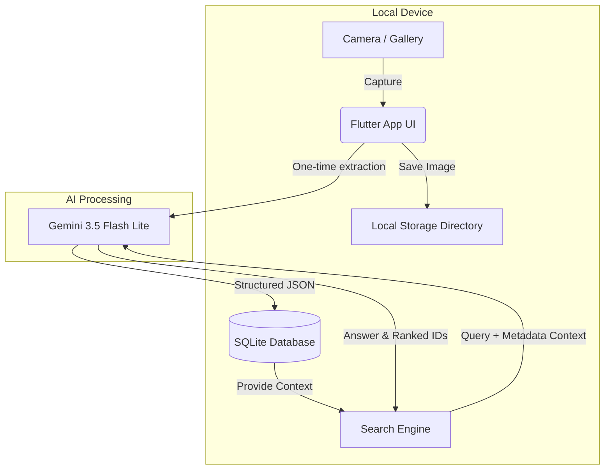

# 🧠 MemoryLens

*Your intelligent, offline-first photographic memory.*

MemoryLens is a mobile application that allows you to photograph real-world information (college notices, receipts, visiting cards, posters, whiteboards) and instantly transforms them into structured, searchable personal memories. It doesn't just save the photo—it understands what matters inside it, connects related memories, and helps you act on important deadlines.

---

## 🏗️ System Architecture

Our architecture is strictly designed around a **"Capture Once, Understand Once, Search Locally"** philosophy to minimize token usage and maximize privacy and speed.

---

## 💡 The Problem & Our Solution

**The Problem:** 
We constantly take photos of whiteboards, receipts, flyers, and event posters to remember them. But these photos get buried in our massive camera rolls. Traditional gallery search relies on basic tags, meaning when you need that hackathon notice, you have to scroll endlessly.

**Our Solution:** 
MemoryLens acts as a second brain. When you snap a photo, the app instantly extracts the context, deadlines, entities, and actions. It stores this highly compressed data locally. When you need it, you just ask in natural language—even in mixed languages like Hinglish or Marathi—and MemoryLens surfaces the exact memory and a conversational answer.

---

## 🧗 Challenges Faced & How We Overcame Them

### 1. The Token Cost & Latency Trap
**Challenge:** Sending images to an AI vision model every single time a user performs a search is incredibly slow, expensive, and burns through API tokens rapidly.
**How we overcame it:** We implemented a strict **"Capture Once" pipeline**. The image is processed by the AI *only* at the moment of capture. All extracted data (Title, Summary, Dates) is saved to a local SQLite database. All subsequent searches are performed entirely on this compressed text metadata, saving 95% on token costs and reducing search latency to milliseconds.

### 2. Complex Reasoning vs. Traditional Vector Search
**Challenge:** Standard Semantic Search (Cosine Similarity on Embeddings) is great at keyword matching, but it completely fails at temporal logic (e.g., *"What deadlines do I have next week?"*) and struggles with local slang.
**How we overcame it:** We bypassed traditional vector databases in favor of a **Massive Context Window Shortcut**. Because we use the lightning-fast Gemini 3.5 Flash Lite model, we can feed the highly-compressed text of the user's most recent memories directly into the LLM during search. This allows the AI to perform complex temporal reasoning and flawless multi-lingual translation on the fly, returning the exact memory IDs required.

### 3. State Management & Navigation Complexity
**Challenge:** Maintaining complex asynchronous states (AI processing, Voice-to-Text listening, Database syncing) across a multi-tab application without crashing or losing data when switching screens.
**How we overcame it:** We utilized **Riverpod** for robust, predictable state management, paired with a persistent `IndexedStack` App Shell. This ensures that memory caching, active AI processing states, and dynamic theme changes (our custom Peach/Terracotta identity) remain perfectly in sync without unnecessary widget rebuilds.

---

## 🛠️ Tech Stack
*   **Frontend:** Flutter & Dart
*   **State Management:** Riverpod
*   **Local Storage:** SQLite (`sqflite`), `path_provider`
*   **AI Intelligence:** Google Gemini API (`gemini-3.5-flash-lite`)
*   **Voice Search:** `speech_to_text`
