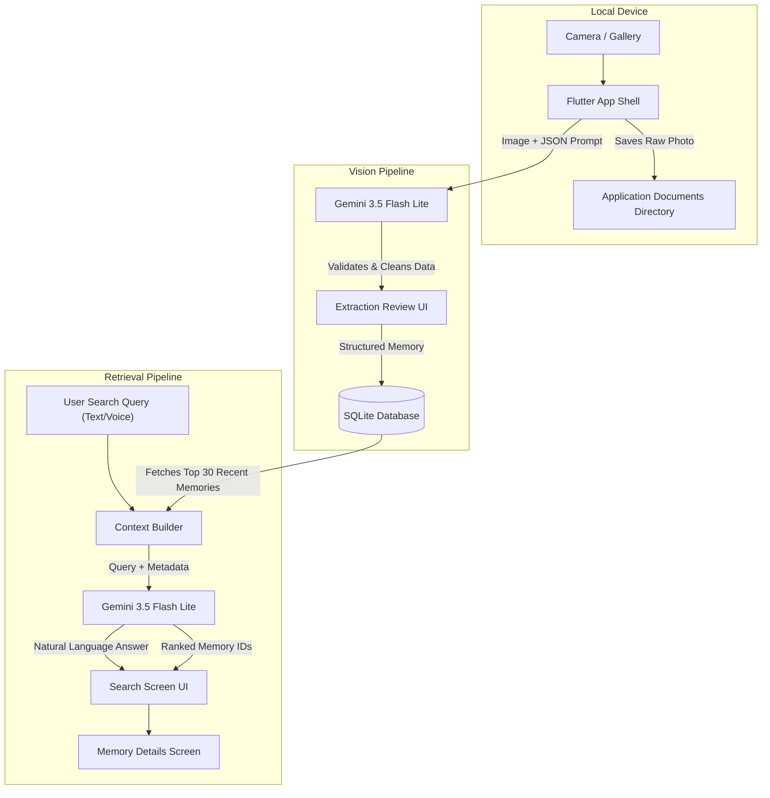

# 🧠 MemoryLens

### Your camera remembers what you don't.

> Turn real-world information into intelligent, searchable memories.

MemoryLens lets you photograph something important and transforms it into structured memory—extracting what matters, detecting dates and deadlines, and allowing you to later ask natural-language questions about what you've seen.

---

## 1. The Core Story

People constantly encounter information that matters:
* College notices
* Hackathon posters
* Event announcements
* Receipts & Bills
* Visiting cards
* Whiteboards & Sticky notes
* Medicine labels

They capture them.
**Then forget about them.**

The problem isn't: *"I don't have the information."*
The problem is: *"I can't remember WHERE I saw it."*

MemoryLens turns the phone's camera into an external memory system.

Our core philosophy:
**CAPTURE ONCE.**
**UNDERSTAND ONCE.**
**REMEMBER FOREVER.** 
*(Forever refers to your locally stored SQLite database, safely kept on your own device).*

---

## 2. The Idea

You see something important.
↓
You capture it.
↓
MemoryLens understands it.
↓
It becomes a structured memory.
↓
You forget about it.
↓
Later, you ask MemoryLens.
↓
It finds it.

A normal gallery answers: *"Where are my photos?"*
MemoryLens answers: *"What was that thing I saw?"*

---

## 3. The Problem

People already use screenshots, camera photos, notes apps, and gallery folders to save things. But these systems preserve **pixels**, rather than **memory**.

For example:
* *"I saw a hackathon poster somewhere."*
* *"I saved a bill but don't remember which one."*
* *"Which photo had the internship deadline?"*
* *"What was the event near the library?"*

The information exists somewhere in the 5,000 photos on your phone. Retrieving the information later is the hard part.

---

## 4. The Solution

MemoryLens converts static images into an actionable, intelligent database:

**RAW IMAGE**
↓
**VISUAL UNDERSTANDING**
↓
**OCR / TEXT EXTRACTION**
↓
**STRUCTURED INFORMATION**
↓
**LOCAL MEMORY**
↓
**NATURAL LANGUAGE RETRIEVAL**

The original image is preserved completely locally on your device, while the highly structured information (deadlines, summaries, entities) is stored for instantaneous conversational retrieval.

---

## 5. Why MemoryLens?

While apps like Google Photos can perform powerful image search, they are designed for archiving your life. MemoryLens is designed specifically around the workflow of: **"Capture real-world information → turn it into actionable personal memory."**

**Traditional Gallery:**
Photo → Folder → Search by filename or date

**MemoryLens:**
Photo → Understand → Structure → Remember → Search by meaning

We emphasize:
* Structured extraction (Who, What, When)
* Automatic deadline detection
* Mobile-first capture workflow
* Conversational retrieval
* 100% Local storage

---

## 6. Core Features

### 📷 Smart Capture
Capture instantly from your camera or upload from your gallery.

### 👁️ Vision Understanding
Google Gemini instantly analyzes the image, reading messy handwriting, complex event posters, and receipts to understand the true visual context.

### 📝 Structured Memory
Instead of storing a massive block of unreadable OCR text, MemoryLens extracts:
* Title & Summary
* Category (Event, Receipt, Document, Notice)
* Exact Dates & Deadlines
* Key Entities & Action items

### 🔎 Natural Language Search
Stop searching for filenames. Ask questions naturally:
* *"What was that hackathon notice?"*
* *"What deadlines are coming up?"*
* *"Which receipt had the electricity bill?"*

### 🎙️ Voice Search
Tap the microphone and ask out loud! MemoryLens supports voice-to-text queries, and thanks to the underlying LLM processing, it handles mixed languages (like Hinglish or Marathi) effortlessly.

### 🔔 Reminders
Automatically detect deadlines from posters and set proactive reminders. You can also create purely manual text-based reminders without a photo.

### 🧠 Remember Screen
A proactive dashboard that acts as your second brain, surfacing upcoming deadlines and recently relevant information before you even have to ask.

### 📚 Memory Browser
A dedicated space to browse all your memories, filter by category (Events, Receipts, Notices, Opportunities), and quickly find what you need.

---

## 7. Real User Journey

A student sees a college hackathon notice in the hallway.

**STEP 1:** 📷 They take a picture with MemoryLens.
**STEP 2:** MemoryLens processes the image in the background.
**STEP 3:** It extracts exactly what matters:
> **Title:** AI Innovation Hackathon
> **Deadline:** September 5, 11:59 PM
> **Location:** Main Auditorium
> **Category:** Event
**STEP 4:** The student reviews the extracted information.
**STEP 5:** The memory is safely stored entirely locally.
**STEP 6:** Three days later, the user forgets the details and asks the app: *"What was the hackathon notice I saw?"*
**STEP 7:** MemoryLens instantly finds the relevant memory and provides a conversational answer.
**STEP 8:** The user can tap to view the original image for verification.
**STEP 9:** The user sets a calendar reminder for the deadline.

---

## 8. Screen / UX Walkthrough

### 🏠 Home
The primary dashboard. Gives you a quick overview of your recent captures, quick action buttons to snap a new photo, and access to the global search bar.

### 🧠 Remember
A dedicated proactive tab. It doesn't wait for you to search—it brings upcoming deadlines and highly relevant saved information to your attention.

### 📷 Capture
The entry point. Opens a custom bottom sheet to let you choose between snapping a new photo, picking from your gallery, or quickly logging a manual reminder.

### ⏳ Processing
A beautifully animated loading screen that clearly communicates MemoryLens is analyzing the visual context of your image.

### ✅ Extraction Review
Before anything is saved, you get to verify, edit, and confirm the AI-extracted information, ensuring your database remains perfectly accurate.

### 🔍 Search
A powerful conversational interface. Ask natural-language questions, use voice search, and get direct answers alongside the relevant memory cards.

### 📄 Memory Details
The deep-dive view. Shows your original, uncompressed image at the top, followed by the structured AI summary, entities, and actions.

### ⏰ Reminders
Your command center for time. Manage all upcoming, overdue, and completed reminders that were either auto-extracted or manually created.

---

## 9. Visual Design

MemoryLens completely rejects the generic "AI Purple" or "Sterile Utility White" aesthetic.

We utilize a **Peach / Terracotta** design language that feels personal, warm, premium, and calm. 

*   **Light Theme:** Uses warm cream, soft peach, and terracotta accents.
*   **Dark Theme:** Uses deep warm brown and muted terracotta for a comfortable nighttime experience.

**Typography System:**
*   **Brand / Decorative Font:** *Yellowtail* (Used sparingly for branding, headers, and expressive moments).
*   **Functional UI:** *Manrope* (Clean, highly legible sans-serif for all body content, data, and search queries).

---

## 10. System Architecture

MemoryLens is built on a highly optimized **"Capture Once, Search Locally"** pipeline. We heavily minimize token usage by processing the heavy vision tasks only once, and relying on ultra-fast metadata context for searches.

### Technical Highlights
*   **LLM Context Optimization:** Instead of running expensive OCR on 100 images during a search, we only send the highly compressed text summaries (Title, Category, Dates) to the LLM. 
*   **Complex Reasoning over Vector DBs:** We intentionally bypassed local vector databases (Semantic Search) for this prototype. By passing the compressed memories directly into Gemini's massive context window, the AI can perform complex temporal reasoning (e.g., *"What's due next week?"*) and multi-lingual translation (Marathi/Hinglish) that simple cosine similarity struggles with.
*   **Riverpod & IndexedStack:** The app uses robust state management and a persistent navigation shell to ensure AI processing, voice listening, and dynamic theme switching run flawlessly without losing UI state.
*   **Custom Navigation (PopScope):** We intercepted the Android system back-button to ensure users are naturally routed back to the Home tab rather than accidentally exiting the app.
